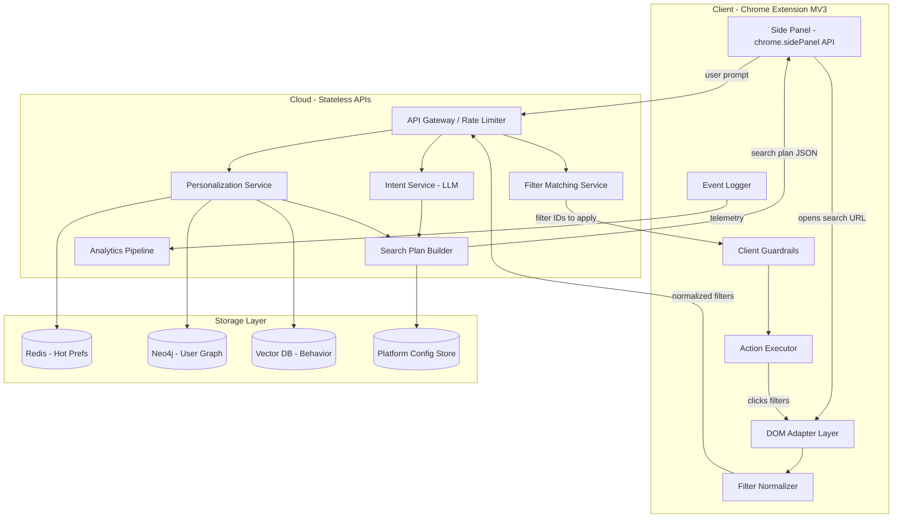

# AI Commerce Agent -- Analysis and Refined Implementation Plan

---

## 1. What Is Being Built (Plain English)

The spec describes an **AI-powered shopping assistant** that lives as a **browser extension** on the user's device. In simple terms:

- A user types something like *"Buy me a white t-shirt under 500 rupees, fast delivery"*
- The system figures out what the user wants (intent), enriches it with things it already knows about the user (e.g., preferred brands, size), and decides which e-commerce platform to use (Amazon, Flipkart, etc.)
- It opens the search results page on that platform, reads the page structure to find available filters (price ranges, ratings, delivery options), and **automatically applies the right filters** to narrow down results
- It can assist through checkout but **never autonomously pays** -- that remains a human action

The architecture splits work between:

- **Cloud APIs** (stateless): Understand the user's intent, apply personalization, and build a search plan
- **Client-side browser extension**: Parse the actual e-commerce page, match intent to available filters, click UI elements deterministically, and enforce safety guardrails

A small on-device LLM (e.g., Qwen2.5-7B) handles only the semantic matching between the intent (what the user wants) and the available filters (what the page offers). All actual UI interactions are code-driven, never LLM-driven.

---

## 2. Justification -- Pros and Cons

### Why Build This

- **Genuine user pain point**: Shopping across multiple Indian e-commerce platforms (Amazon, Flipkart, Myntra, Swiggy, BigBasket, Zepto) is repetitive and time-consuming. Automating search, filtering, and comparison saves real user time.
- **Massive addressable market**: India has 300M+ online shoppers. Reliance's existing ecosystem (JioMart, Ajio, JioCinema, Jio telecom) provides a natural distribution channel for a browser extension.
- **Privacy-first architecture is a differentiator**: Credentials never leave the device, DOM is never sent to the cloud, and the LLM never directly clicks anything. This is a strong trust signal for users.
- **Personalization creates a moat**: Over time, the system learns user preferences (sizes, brands, price sensitivity, delivery preference) -- making it stickier the longer someone uses it.
- **Progressive autonomy model is sound**: Starting with search/filter assistance (low risk) and gradually expanding to cart/checkout (higher risk) is the right product strategy.
- **Platform-agnostic value**: Unlike Amazon's or Flipkart's own AI features, this works across all platforms and can compare between them -- something no single platform will ever offer.

### Risks and Concerns

- **DOM fragility**: E-commerce sites change their HTML structure frequently (A/B tests, redesigns, framework upgrades). Rule-based DOM parsers will break regularly, requiring constant maintenance per platform.
- **Terms of Service risk**: Automating actions on Amazon, Flipkart, etc. likely violates their ToS. This is the single biggest existential risk -- platforms could detect and block the extension, or pursue legal action.
- **Local LLM on consumer hardware is very hard**: Running a 7B-parameter model in-browser via WebGPU requires ~4-8 GB of VRAM. Most Indian consumers use mid-range devices. This will fail silently on a large portion of the target audience.
- **Mobile-first market, desktop-only solution**: 80%+ of Indian e-commerce traffic is mobile. A browser extension only serves desktop users, which is a small fraction of the target "few million users/day."
- **3-month timeline is unrealistic** for the full scope described in the questionnaire (multi-platform, payment, order tracking, returns, comparison).
- **Platform countermeasures**: E-commerce sites employ anti-bot measures (CAPTCHAs, fingerprinting, rate limiting) that will escalate if this tool becomes popular.
- **No revenue model defined**: Building for millions of users without a clear monetization path is risky.
- **Competition**: Tools like Honey (PayPal), Capital One Shopping, and emerging AI shopping agents already exist, though none are India-focused at this scale.

---

## 3. Gaps in the Current Spec

### 3.1 Critical Technical Gaps

**A. Local LLM Feasibility Is Unvalidated**

The spec recommends Qwen2.5-7B or Phi-3-mini via WebGPU but does not address:

- Memory and VRAM requirements (7B quantized still needs ~4GB)
- Model download size (~4GB) and caching strategy
- Inference latency on average Indian consumer hardware (most users have 8GB RAM machines)
- What happens when WebGPU is unavailable (older browsers, integrated GPUs)
- Impact on battery life and system performance
- No fallback path if local LLM is infeasible -- should this be a lightweight cloud API call instead?

**B. DOM Parsing Strategy Is Underspecified**

- The spec says "rule-based" but gives no detail on how parsers are structured or maintained per platform
- Each platform (Amazon, Flipkart, Myntra, Swiggy, BigBasket, Zepto) has a completely different DOM structure, filter mechanism, and search URL format
- No strategy for handling platform A/B tests (different users see different layouts)
- No versioning or update mechanism for DOM parsers when platforms change their UI
- No detail on how lazy-loaded or dynamically rendered filters are handled

**C. Cross-Platform Comparison Is Missing**

The questionnaire explicitly calls out "compare products between multiple platforms" but the spec has zero design for this. This requires:

- Running searches on multiple platforms simultaneously
- Normalizing product data across platforms (different naming, pricing, delivery formats)
- A comparison UI or summary mechanism

**D. Mobile Support Is Absent**

The questionnaire mentions "app agent" as a delivery mechanism, but the spec only covers Chrome extension. This is critical given India's mobile-first user base.

### 3.2 Scope Contradictions Between Spec and Questionnaire

| Topic      | Questionnaire Says                                 | Spec Says                       | Gap                  |
| ---------- | -------------------------------------------------- | ------------------------------- | -------------------- |
| Payment    | "complete buying journey including payment"        | "Payment = Human only"          | Direct contradiction |
| Platforms  | Amazon, Flipkart, Swiggy, BigBasket, Zepto, Myntra | Only Amazon examples            | 5 platforms missing  |
| Post-order | "order tracking, post order service like return"   | Phase 2 mention only, no design | No architecture      |
| Mobile     | "browser extension / app agent"                    | Browser extension only          | Mobile missing       |
| Comparison | "compare products between multiple platforms"      | Not addressed                   | Entirely absent      |

### 3.3 Scale and Infrastructure Gaps

- **Target is "few million active users/day"** but no capacity planning, auto-scaling strategy, or cost modeling
- No rate-limiting strategy to avoid getting blocked by e-commerce platforms
- No cost estimate for cloud LLM calls at scale (even at $0.01/call, 5M users/day = $50K/day)
- No CDN or edge deployment strategy for low-latency API responses across India

### 3.4 Business and Legal Gaps

- **No legal analysis** of Terms of Service compliance with target platforms
- **No revenue model** -- how does this make money?
- **No user acquisition plan** -- how do you get to millions of users?
- **No competitive analysis** -- what exists today and how is this better?
- **No partnership strategy** -- are e-commerce platforms aware/supportive, or will they resist?

### 3.5 Operational Gaps

- **No monitoring/observability plan**: How are failures detected in production? What dashboards exist?
- **No CI/CD or deployment strategy** for the browser extension (Chrome Web Store review process takes time)
- **No A/B testing framework** for the agent's behavior
- **No user feedback mechanism** -- how do users report that the agent made a mistake?
- **No analytics plan** -- what metrics define success (task completion rate, time saved, user retention)?
- **No on-call/incident response plan** for when a platform changes its layout and the agent breaks for millions of users

---

## 4. Refined Implementation Plan

### Guiding Principles for the Revised Plan

1. **Drop local LLM for v1** -- use a lightweight cloud API call for semantic filter matching instead. Revisit local LLM when WebGPU ecosystem matures. This removes the single biggest technical risk.
2. **Start with 2 platforms, not 6** -- Amazon India and Flipkart cover ~70% of Indian e-commerce. Add more later.
3. **Build the DOM parsing layer as a pluggable, versioned adapter system** -- so adding new platforms or handling layout changes is a configuration change, not a code rewrite.
4. **Ship search + filter assistance first** -- defer cart, checkout, payment, tracking, and returns to later phases.
5. **Instrument everything from day 1** -- you cannot operate at millions of users without observability.

### Architecture (Revised)



**Key change**: Filter matching moves from local LLM to a lightweight cloud service. This is a simple semantic matching task (not generative) that can be served by a small model or even embedding similarity -- fast, cheap, and reliable.

### User Interaction Model — Chrome Side Panel

The primary UI is a **Chrome Side Panel** (`chrome.sidePanel` API, requires Chrome 114+). This was chosen over:

- **Popup**: Too small for a chat-style flow; closes when the user clicks away, breaking multi-step workflows
- **Content script overlay**: Fragile (conflicts with site CSS/z-index), feels intrusive, and risks being detected as injected UI by platform anti-bot systems

**How it works:**

1. User clicks the extension icon → Side Panel opens on the right edge, **persisting alongside the active tab**
2. Chat-style input at the bottom — user types a natural language prompt
3. Main area shows step-by-step progress, then results

**Interaction flow:**

| Step | Side Panel Shows | What Happens Behind the Scenes |
|------|-----------------|-------------------------------|
| User types prompt | Input box active | — |
| Processing intent | "Understanding your request..." | Cloud: Intent + Personalization APIs |
| Search plan ready | "Searching Amazon India..." | Content script opens search URL in active tab |
| Parsing filters | "Found 12 filters on this page" | Content script: DOM parsing + normalization |
| Applying filters | "Applying: Color: White, Price: Under ₹500, Delivery: Prime" | Cloud: Filter Matching → Content script clicks filters |
| Done | Results summary with product cards | — |
| Compare (Phase 2) | "Also found on Flipkart at ₹399" | Parallel search on second platform |
| Cart assist (Phase 3) | Cart summary + "Confirm add to cart?" | Waits for explicit human confirmation |

**Message passing architecture:**

```
Side Panel  ←─ chrome.runtime.sendMessage ─→  Service Worker (Background)
                                                       │
                                               chrome.tabs.sendMessage
                                                       │
                                                       ▼
                                                Content Script (DOM)
```

The Side Panel never touches the DOM directly. All DOM operations go through the Service Worker relay to the Content Script, maintaining clean separation.

**Side Panel states:**

- **Idle**: Welcome message, past search history, quick re-run buttons
- **Processing**: Step-by-step progress with spinner per stage
- **Results**: Applied filters summary, product cards, comparison option
- **Error**: Clear message with retry/fallback (e.g., "CAPTCHA detected — please solve it manually")
- **Unsupported Site**: "This site is not yet supported. Currently works on Amazon India and Flipkart."

### Phase 1: Foundation (Weeks 1-4)

**Goal**: End-to-end flow working on Amazon India only, for search + filter application.

- **Week 1-2: Cloud Services**
  - Set up FastAPI project structure with proper CI/CD
  - Implement Intent Service: prompt + personalization -> structured intent JSON
    - Use Claude API for intent extraction with strict JSON output schema
    - Define and validate output schema using Pydantic
  - Implement basic Personalization Service (Redis-backed, hardcoded profiles for testing)
  - Implement Search Plan Builder for Amazon India URL generation
  - Implement Filter Matching Service (embedding-based similarity between intent constraints and normalized filter labels)
  - All APIs behind an API Gateway with auth, rate limiting, and request logging
- **Week 1-2: Chrome Extension (parallel)**
  - Scaffold Chrome Extension (Manifest V3) with TypeScript and Vite
  - Build Side Panel UI using `chrome.sidePanel` API:
    - Chat-style prompt input with send button
    - Scrollable results/status area with step-by-step progress indicators
    - Idle state with search history and quick re-run buttons
    - Error and unsupported-site states
  - Implement message passing: Side Panel ↔ Service Worker ↔ Content Script via `chrome.runtime.sendMessage` and `chrome.tabs.sendMessage`
  - Build Amazon India DOM Adapter:
    - Search results page parser (extract product cards)
    - Filter sidebar parser (extract all filter groups with labels and element refs)
    - Use MutationObserver for dynamic content detection
  - Implement Filter Normalizer (convert "Under 500" -> `{type: "price", max: 500}`)
- **Week 3: Integration and Execution**
  - Wire cloud APIs to extension (prompt -> intent -> search plan -> open URL)
  - Wire DOM-parsed filters through cloud Filter Matching Service
  - Implement deterministic Action Executor:
    - Click only whitelisted element refs
    - Sequential execution with `waitForDOMStable()` between each
    - Abort on unexpected state (CAPTCHA, login prompt, navigation away)
  - Implement Client Guardrails:
    - JSON schema validation on all API responses
    - Filter ID whitelist enforcement
    - Max actions per session limit
    - Blocked action types (no form fills, no payment clicks)
  - Event logging (every action, every API call, every error) sent to analytics pipeline
- **Week 4: Testing and Hardening**
  - Unit tests for DOM parsers against saved HTML snapshots of Amazon pages
  - Integration tests for full flow (prompt -> filters applied)
  - Guardrail tests (hallucinated IDs, malformed responses, CAPTCHA scenarios)
  - Load testing for cloud APIs (target: 100 req/sec initially)
  - Manual QA across 20+ product categories on Amazon India
  - Fix edge cases: lazy-loaded filters, pagination, variant filter types

### Phase 2: Second Platform + Robustness (Weeks 5-8)

**Goal**: Add Flipkart, harden DOM parsing, build adapter abstraction.

- **Week 5-6: Platform Adapter Framework**
  - Abstract DOM parsing into a pluggable adapter interface:
    ```typescript
    interface PlatformAdapter {
      platform: string
      version: string
      detectPage(): PageType  // search, product, cart, etc.
      extractFilters(): NormalizedFilter[]
      extractProducts(): ProductCard[]
      getFilterElement(filterId: string): HTMLElement | null
    }
    ```
  - Move Amazon-specific logic into `AmazonAdapter`
  - Build `FlipkartAdapter` using same interface
  - Implement adapter versioning and remote config for selectors (so selector changes can be pushed without extension update)
  - Build a "selector health check" that runs on page load and reports which expected selectors are missing (early warning for layout changes)
- **Week 7: Personalization and User Profiles**
  - Build proper user profile storage (Redis for hot data, Neo4j for relationship graph)
  - Implement preference learning from user actions (if user always picks Nike, increase Nike affinity)
  - Implement cross-session memory (remember past searches, sizes, preferred platforms)
- **Week 8: Cross-Platform Comparison (Basic)**
  - Implement parallel search across Amazon + Flipkart for same intent
  - Normalize product data (price, rating, delivery estimate, seller) across platforms
  - Display comparison in extension side panel
  - Let user choose which platform to proceed on

### Phase 3: Scale Readiness + Cart Assist (Weeks 9-12)

**Goal**: Production-harden for scale, add cart assistance, prepare for launch.

- **Week 9-10: Scale and Operations**
  - Auto-scaling for cloud services (Kubernetes / ECS)
  - CDN for API responses where applicable
  - Implement circuit breakers for LLM API calls (fallback to rule-based intent parsing)
  - Build monitoring dashboards:
    - Task completion rate per platform
    - DOM parser success/failure rates (critical operational metric)
    - API latency percentiles
    - Error rates by type
    - User funnel (prompt -> search -> filters -> comparison -> cart)
  - Implement alerting for DOM parser failures (if success rate drops below threshold, page someone)
  - User feedback mechanism ("Was this helpful? What went wrong?")
- **Week 11: Cart Assistance**
  - Implement "Add to Cart" action (still requires user confirmation)
  - Build cart summary view in side panel
  - Navigate to checkout page (stop before payment)
  - Human confirmation step before any cart/checkout action
- **Week 12: Launch Preparation**
  - Chrome Web Store submission (allow 5-7 days for review)
  - Internal dogfooding with 100+ users
  - Performance profiling and optimization
  - Documentation: user guide, developer guide, runbook
  - Incident response plan for platform layout changes
  - Gradual rollout plan (1% -> 10% -> 50% -> 100%)

### What Is Explicitly Deferred (Post-3-Months)

These items from the questionnaire are deferred to Phase 4+ as they are not achievable in 3 months without sacrificing quality:

- **Autonomous payment**: Requires extremely high trust and extensive testing
- **Order tracking**: Requires authenticated session handling on each platform
- **Returns/post-order service**: Requires deep integration with platform-specific flows
- **Swiggy, BigBasket, Zepto, Myntra**: Add one platform per sprint after launch using the adapter framework
- **Mobile app agent**: Requires entirely different technology stack (accessibility services on Android, etc.)
- **Local on-device LLM**: Revisit when WebGPU support and consumer hardware catch up

### Critical Pre-Requisites Before Development Starts

1. **Legal review**: Get a formal legal opinion on ToS compliance with Amazon India and Flipkart. This could kill the project -- do it first.
2. **LLM cost modeling**: Estimate per-user cost for cloud LLM calls at target scale. If Claude API costs are too high, evaluate fine-tuned smaller models or embedding-based approaches.
3. **Team allocation**: This plan requires at minimum 2 frontend (extension) engineers, 2 backend engineers, 1 ML/AI engineer, and 1 QA engineer.
4. **Platform relationship**: Determine whether Reliance can leverage its business relationships with Amazon/Flipkart to get some level of approval or API access.
