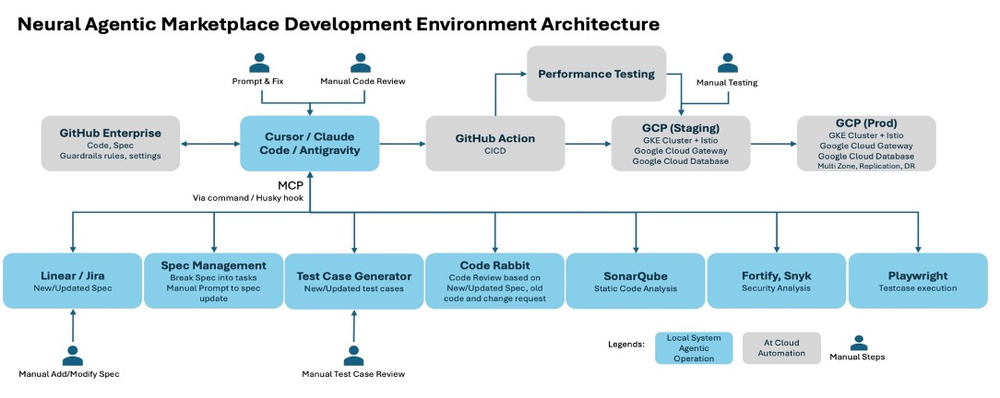

Please read the following target development environment/process that we want to establish:
Development Environment Architecture

The following diagram illustrates how we are using an LLM-based coding environment and integrating it tightly with product specification tools, code review systems, testing frameworks, security analysis platforms, and the CI/CD pipeline. This integrated, agent-assisted development environment enables a dramatic reduction in Product and Technology workforce—from nearly 1,000 engineers to fewer than 50—while maintaining quality, security, and delivery velocity.

Specs flow directly to code: Product requirements from Linear/Jira are converted into code, tests, and configs by LLM-based coding agents, eliminating large implementation teams.
Automated quality replaces manual review: Agent-driven code review, static analysis, and security scanning handle most checks, with humans intervening only for exceptions.
Test creation and execution are fully automated: Test cases are generated from specs and executed continuously in CI, removing the need for large QA teams.
End-to-end CI/CD is autonomous: Builds, validations, and deployments run automatically via GitHub Actions and GCP, minimizing DevOps and release overhead.
Humans focus only on high-leverage decisions: Manual effort is limited to prompt tuning and critical reviews, enabling a 20×–30× productivity increase and reducing teams from ~1000 to <50.

